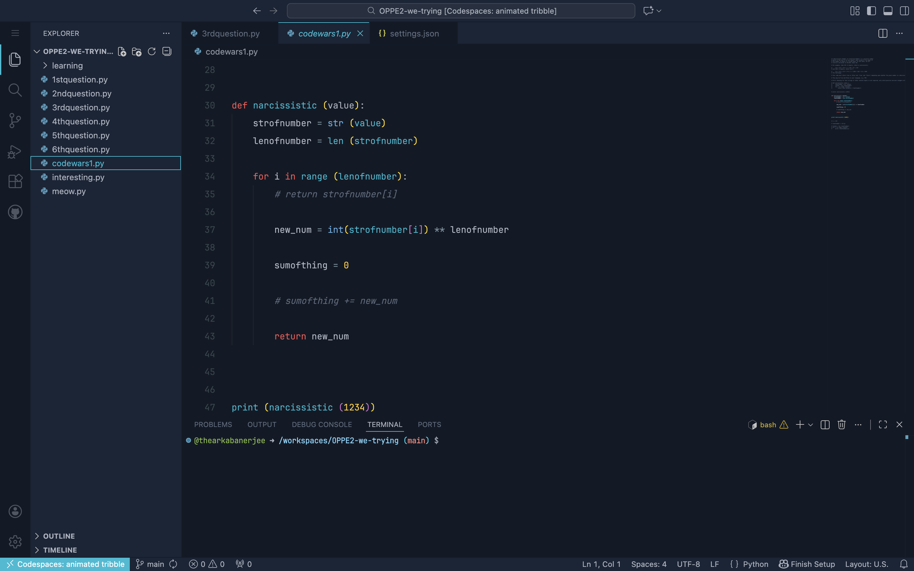
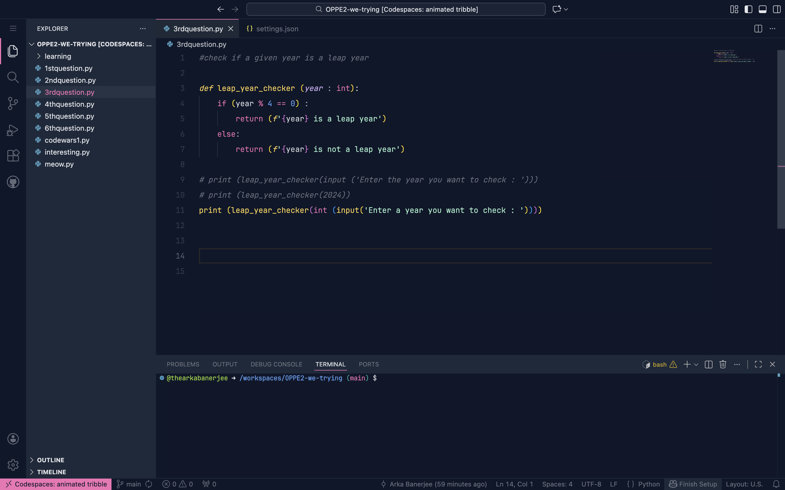

# compact-vs-code README

## Anya & Perry Theme Pack

This extension brings two vibrant and character-inspired themes to Visual Studio Code. Designed for developers who want their editor to feel fun, expressive, and visually striking, the Anya & Perry Theme Pack blends strong color identity with readable syntax highlighting.

## Themes Included

### Perry the Platypus

A cool, teal-driven theme inspired by Perry’s iconic color palette. It mixes deep aquatic backgrounds with bright, playful accents that make your code pop without overwhelming your eyes during long sessions.

### Anya

A warm, energetic theme inspired by Anya’s cheerful aesthetic. Soft pinks, smooth contrasts, and expressive highlights give your editor a lively personality, perfect for users who like a cozy yet modern look while coding.

## Installation

1.  Search for **Compact-VS-Code** in the Extensions view inside VS Code.
2.  Click **Install**.
3.  Open the **Command Palette** (`Ctrl+Shift+P` or `Cmd+Shift+P`).
4.  Select **Preferences: Color Theme** and choose your favorite Hashira theme.
5.  Select either **Perry-the-Platypus** or **Anya**.

## Features

Both themes support syntax highlighting across all major languages, terminal colors, editor UI elements, and semantic token coloring. The themes are carefully tuned to remain readable, comfortable, and consistent throughout your workflow.

## Contributing

Contributions are welcome! Please open an issue or submit a pull request on GitHub.

## Feedback

If you have ideas, suggestions, or improvements, feel free to open an issue or submit a pull request on the repository. Your feedback helps make the themes better for everyone.

## License

This project is licensed under the MIT License. You are free to modify, distribute, and use the code as long as the original license is included.

## follow Me

- https://github.com/thearkabanerjee

**Enjoy!**